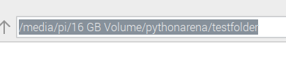
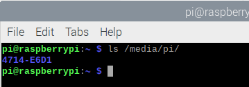
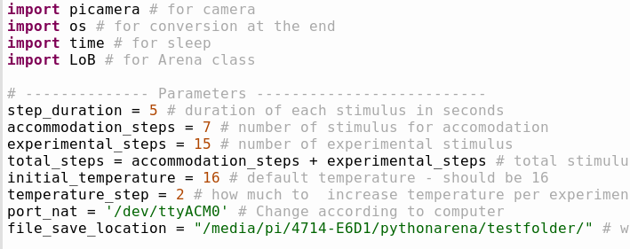
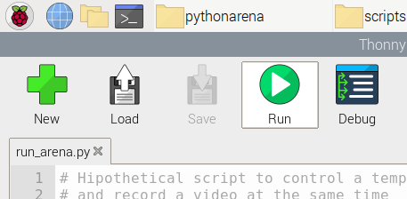
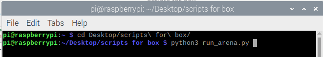

```{css, echo=FALSE}
h1, h2, h3, h4 {
  text-align: left;
}
```

# Introduction

The temperature arena (also called "the box") is a rectangular arena composed of 3 temperature controlled square copper tiles. The temperature of these tiles is controlled by an Arduino Due by the use of a [pielter element](https://en.wikipedia.org/wiki/Thermoelectric_effect) (a device that transforms voltage differences into temperature differences) and a feedback loop which allows it to maintain the desired temperature. This is all connected to a cooling system that helps dissipate the heat generated by the pielter element.

To control the temperature in the box, we send commands to the Arduino via the USB cable. The specific commands are then interpreted by the Arduino which will perform the action. This part is the main concern of this document.

The code I explain in this document and the document itself can be found on [GitHub](https://github.com/marioasmira/TemperatureArenaControl). 
<br><br><br><br>

# Two parts - Arduino and Python

## Arduino
The Arduino itself is programmed in a programming language very similar to C++. To upload your program to the Arduino you'll need to use the [Arduino IDE](https://www.arduino.cc/en/software) (Integrated Development Environment). This IDE will allow you to check if your code compiles (can be turned into a working program without errors) as well as upload your compiled program into the Arduino hardware. Once uploaded, the program will run for as long as the Arduino is powered.

This is also how the box works. Once you plug the USB cable into a computer, the Arduino will receive power throught the cable and start the program. This consists of setting up all the important parts (generate initial temperature readings, turn on the LCD and show a message, *etc.*) and starting the program loop. This loop is where most of our working time will occur. During this loop, the program is listening to all messages sent through the USB connection and trying to match them with the instructions programmed into it.

By using the Arduino IDE we can already send some commands to the Arduino. Assuming everything is connected (USB between Arduino and computer, box cooling is powered and you are able to detect the Arduino on the Arduino IDE), by using the serial monitor we can send commands directly (the serial monitor is found in Tools > Serial Monitor). This tool is also useful to debug the program already in the Arduino. For example, typing `VERSION` into the serial monitor will send this command to the Arduino. The Arduino then reads this commands and does the following
```
Case ("VERSION")
  SerialUSB.println(version);
```
Which means: if the message received matches "VERSION" send the version number of this program through the USB connection. In the version I'm working with, we would see a message appearing in the serial monitor displaying `2.0e`. Similarly, if we were to send `SETTILETEMP=[20,20,20]` through the serial monitor the following code would be used
```
Case ("SETTILETEMP")
    if (getNumberOfArguments(Input, ',') == 3)
    {
      for (int i = 0; i <= 2; i++) {
        tilesDesiredTemp[i] = Str2Int(getValue(Input, ',', i));
        float td = tilesDesiredTemp[i] - val2tempTile(analogRead(getTiles[i]));
        if (td > 3)
          BoostUntil[i] = millis() + (BOOSTDURATION * td);
      }
    }
```
Which means: if the input has 3 arguments (to receive information for the 3 tiles) go through each tile and change it to the new respective temperature. And because we don't want to type out commands every minute to change tile temperatures we can use other programming languages to automate and facilitate these experiments. Originally this was written in Matlab. To make it a bit more open and easier to run on a Raspberrry Pi, I translated the Matlab code into Python.
<br><br><br><br>

## Python

Python is a relatively easy programming language to understand and is widely used both in science and in general computing. I chose this language due to its ease of use (it's very easy to make a new script and run it without the need to compile anything) and its support on the Raspberry Pi. The Python used to run the box is made up of 2 files: `LoB.py`, a direct translation of the original version in the Matlab programming language and defines how to control the box; and `run_arena.py`, the script that is run for each experiment controlling box temperatures and durations, the picamera, and reformatting the videos from `h264` into `MP4`.

I will go into a lot more detail on the Python part.
<br><br><br><br>

### `LoB.py`
This file is what defines what is a temperature arena (here defined as a class), what properties it has (for example, which USB port it's using), and what functions can be used to interact with the physical box. Because the box is defined as a class, all the functions described here are used as an attachment of the box itself (this will be much more evident further down). For now let's look at the properties of the box (called `Arena` in the code)

```
class Arena:
    def __init__(self):
        self.arduinoPort = ""; # string to hold the port location
        self.serialHandle = -1; # serial port
        self.version = "0.1"
        self.curTargetBaseTemp = 16; # base temperature for the tiles
        self.curTargetTileTemp = {16, 16, 16}; # current temperature of the tiles
```

This class is called "Arena" (which is the name we'll use when we want to use it in a script) and has 5 properties: the `arduinoPort`, where the computer can find the USB connection; the `serialHandle`, how the computer can interact with the Arduino; the `version`, version of the file; the `curTargetBaseTemp`, the base temperature to set the tiles; and the `curTargetTileTemp`, the temperature we want the tiles to be.

To work with this class and to modify these values we use the functions defined in the rest of the file. We use these functions as demonstrated in this example
```
import LoB

arena = LoB.Arena()
arena.Init('/dev/ttyACM0') 
arena.Message('Init done') 
arena.LED(0,0)
arena.SetBaseTemp(16) 
arena.SetTileTemp(16, 16, 16) 
```

First we import the `LoB.py` file to be used in our script (which is a different file). Next we make a new `arena` object by defining it as the class `Arena` from the `LoB` file. Then we initialize our `arena` object with the `Init()` function which takes 1 argument: the location of the USB port. Afterwards we do some setup on the box: we use the `Message()` function to display a message on the box LCD, making sure the connection is correct; we use the `LED()` function to make sure both LEDs in the box are turned off; we use the `SetBaseTemp()` function to set the base temperature of the experiment to 16°C; and we use the `SetTileTemp()` with 3 arguments to set the 3 copper tiles to 16°C.

This small example demonstrated 3 things: how to make a new object of a specific class (in this case `arena` is an object of the class `Arena`); how to use class specific functions (all functions are preceded by `arena.` demonstrating that the functions belong to that object); and that functions can use any number of arguments (in some cases, they can have no arguments at all).

Now that we know that, here's a list of what functions were defined for the `Arena` class, which arguments they need and a small description of what they do. Keep in mind that not all of these are necessary for the experiments. Some of these are only used within the class itself or if something goes wrong. 

Function                    | Description
--------------------------  | ---------------------------------------------------------------
Init(dataPort)              | function to add the attributes and open the serial port to the arduino
Wait(msg, dur)              | function to display a message and wait `dur` amount of seconds
SetBaseTemp(temp)           | function to define the base temperature at which the temperature arena will work
CheckSerialPort()           | function to check if the serial port is open
Message(msg)                | function to send message to arduino
SetTileTemp(t1, t2, t3)     | function to set a triplet of numbers as the temperature for the tiles
AreYouThere()               | function to check if the arduino is responding
GetHandle()                 | function to output the serial information
Stop()                      | function to close and reset the serial connection
LED(l1, l2)                 | function to change the on/off postion of both LEDS in the temperature arena

These functions can then be used on the second file `run_arena.py` to control the box.
<br><br><br><br>

### `run_arena.py`
This file is what would be called the "experiment protocol". It controls the box and the picamera at the same time and defines which timings and temperatures to use. As such, for each specific temperature profiles you would want to use, it would be better to make a copy of this file and change it accordingly. If the profiles are the same and the only difference between experiments is the biology of the flies, there is no need to modify this file. In summary, this is a protocol for the box and the picamera to follow.

I will go over each section of the file to explain and comment on what should and shouldn't be changed. I commented the file as much as possible but I'll go over things in here as well.
<br><br><br><br>

#### Setup

We start with the library imports
```
#---------------- Setup -------------------------------
import picamera # for camera
import os # for conversion at the end
import time # for sleep
import LoB # for Arena class
```
in this setup section we import the libraries necessary to run this "default" experiment: we import `picamera` to be able to control the [Raspberry Pi Camera Module](https://www.raspberrypi.org/products/camera-module-v2/) (if you are using a different camera, for example a webcam, it can also be controlled in this script but you would have to use a different library); we import the `os` library to be able to run commands in the linux terminal as if we were outside the script (we use this at the end to reformat the h264 video file output by the picamera into mp4); we import the `time` library to be able to wait between stages of the experiment; and finally we import the `LoB` library to be able to use the `Arena` class described above.
<br><br><br><br>

#### Parameters

Next we have the variable declaration section
```
# -------------- Parameters --------------------------
step_duration = 60 # duration of each stimulus in seconds
accommodation_steps = 7 # number of stimulus for accomodation
experimental_steps = 15 # number of experimental stimulus
total_steps = accommodation_steps + experimental_steps # total stimulus
initial_temperature = 16 # default temperature - should be 16
temperature_step = 2 # how much to  increase temperature per experimental step
port_nat = '/dev/ttyACM0' # Change according to computer
file_save_location = "" # where to save the video files
```
This will be the first of 2 sections in which there should be more changes between experiments. Each of these parameters controls a certain value which will be used for the set up or during the experimental loop:

Variable                    | Description
--------------------------  | ---------------------------------------------------------------
step_duration               | amount of time (in seconds) each stimulus will last
accommodation_steps         | number of steps to have at the start of the experiment for accommodation
experimental_steps          | number of steps in which to perform the experiment
total_steps                 | total number of steps to go through
initial_temperature         | initial temperature (in °C) for all 3 tiles
temperature_step            | how much the temperature (in °C) increases between each experimental step
port_nat                    | where the computer can find the USB connection to the Arduino
file_save_location          | the location of the folder in which to save the video file

These variables are used for the logic of the "default experiment". If you would design a completely different experiment, these might became obsolete and you might have to make new variables.
<br><br><br><br>

#### Arena

Next we have the arena setup section
```
# ----------- Initialize Arena ----------------------
# Start temperature-controlled box
arena = LoB.Arena() # starts the arena class
arena.Init(port_nat) # connect and initialize the computer to the temperature arena
arena.Message('Init done') # Message will appear on LCD screen
arena.LED(0,0) # Both indicative red LEDs will be off
arena.SetBaseTemp(initial_temperature) # Minimum temperature for continuous cooling
arena.SetTileTemp(initial_temperature, initial_temperature, initial_temperature) #Start-up temperature of each of the three copper tiles
```

This section was already described above in the [`LoB.py`] section. The only difference is that instead of using fixed values for the port and temperatures, we use the values defined in the [Parameters] section.
<br><br><br><br>

#### Pi Camera

Next we initialize the picamera and give a name to the output video file
```
# --------- Initialize Camera ------------------------
# initiate file name and camera object
name_input = input("Video file name (avoid using spaces): ") # ask for video file name
name = file_save_location + name # add the folder location
file = name + ".h264" # append the video file format
camera = picamera.PiCamera() # initialize the camera class
camera.resolution = (1920, 1080) # set resolution
camera.framerate = 30 # set framerate to record
time.sleep(2) # wait 2 seconds for the camera to ajust to light conditions
```
In this section we ask for input from the user to get the file name for the video output. We then use the folder location filled in above in the [Parameters] to make sure then file will end up in the correct location. After that we do something similar to what we did with the `Arena` class but for the `PiCamera` class instead. We declare that the `camera` variable is an object of the class `PiCamera` and define its resolution and framerate. After that we wait 2 seconds for the camera to adjust to the present light conditions.
<br><br><br><br>

#### Experimental protocol
Finally we reach the experimental part of this script. In this section we define how we want the box to work and is the second of the 2 sections which are likely to change between experiments.

```
# -------------------Experiment ----------------------
# stops here and waits for the user to press Enter
input("Press Enter to start the experiment...")

camera.start_preview() # launches a window where the user can see what is being recorded
camera.start_recording(file, format = "h264") # starts the recording
exp_temp = initial_temperature # start the experimental temperature at the same temp as initial

# Start the experimental block
for step in range(1,total_steps):
    if (step % 2) == 0:            # if even number
        arena.LED(1,0)
    else:               # if uneven number
        arena.LED(0,1)
        
    if (step > accommodation_steps):    # The first 7 minutes happen at 16C to allow flies to explore
        exp_temp = exp_temp + temperature_step
    
    arena.SetTileTemp(exp_temp, exp_temp, exp_temp) # changes temperatures to experimental temperature
    arena.Wait(str(step) + "step ", step_duration) # waits for the number of seconds in step_duration
```

We start by waiting for any input from the user. This allows us to start the script and prepare the fly without the worry that the recording will start before we are ready. Once the user presses "Enter" the script will continue into the experimental protocol.

We start by launching the preview of the camera and start the recording process. After this starts we can begin the experimental loop: for a certain number of steps defined by the `total_steps` variable, we check if this number is even or odd to see which of the 2 LEDs to turn on; then, if the step number is higher than the `accommodation_steps` variable, we increment the temperature by the value of the `temperature_step`; we then set all 3 tile temperatures to the new temperature followed by a wait time of the value of the `step_duration` variable; finally, since this is a loop, we restart at the top of the loop with the step incremented by 1.
<br><br><br><br>

#### Reset
In this step we return all relevant values to their default value so we can restart the protocol
```
# ---------------- Reset ---------------------------------------
# stop recording
camera.stop_recording() # stops recording
camera.stop_preview() # stops the window preview

# reset leds and temperatures
arena.LED(0,0) # turns off both leds
arena.SetTileTemp(initial_temperature, initial_temperature, initial_temperature) # returns temperature to initial temperatures
```

Here we stop both the recording and preview on the picamera, we reset the box LEDs so that both are off, and we return the tile temperatures to the value in the `initial_temperature` variable.
<br><br><br><br>

#### Conversion
Finally, we convert the output of the picamera, `.h264`, into `.mp4`. This step was necessary for the tracking software used previously and may not be necessary in the future.

```
# ---------------- Convert to mp4 ---------------------------------------
# commands to immediately convert to mp4
command = "ffmpeg -i " + file + " -vcodec copy " + name + ".mp4" # defines the command to run in the terminal
os.system(command) # runs the command defined above in the terminal
```
Here we define the command we want to run in the linux terminal as a string of characters. We then use the `os.system()` function to run this string of characters as a command. Essentially, we're using the `ffmpeg` program to copy and convert our `experiment.h264` file into a `experiment.mp4` file in the same folder.
<br><br><br><br>

# Actually making it work
Here I assume that everything is correctly plugged and on: the box cooling is plugged into the wall and on; the Arduino is plugged into the the Raspberry Pi; the Raspberry Pi is on and running, and it has the picamera plugged in and [enabled](https://projects.raspberrypi.org/en/projects/getting-started-with-picamera/2). First, we're going to identify which USB port is being used by the Raspberry Pi to connect to the Arduino, and second, we identify the correct path to save video files in an attached external storage (an external HDD for example).
<br><br><br><br>

## Identifying the USB port
As you might have noticed in the previous sections, in these scripts we will need to specify in which Raspberry Pi USB port the Arduino is connected to. It usually has the same value as the one used in this document `/dev/ttyACM0`, or alternatively `/dev/ttyUSB0`. If none of these work, that means it might have one of these names but with a different name. To figure out what this name is you can open a terminal on the Raspberry Pi by going through the menus or by pressing `Ctrl + Alt + T` and running the following
```
ls /dev/tty*
```
This command will list all the devices that start with "tty" in the "/dev/" directory. If you still don't know which is which, you can unplug the Arduino and rerun the same command. The one that is missing will be the Arduino port you will need. Type this port into you script and it shouldn't change (at least while both remain connected :)).
<br><br><br><br>

## Finding external drive path
Assuming you want to save a lot of video files in a safer location than the sd card, you'll have to use some sort of external drive. Luckily, one of the parameters on the experimental script allows us to add the path to a different folder that the one we are running the script on! More specifically, the `file_save_location` variable will just add a prefix to your file name pointing it to the correct location. The value of this variable is empty by default which means if you don't want to save the video in a different folder, you don't need to change anything.

To find the path to your external drive, you can use the file explorer itself. If you click in the path at the top of the window you should be able to copy it and paste it in the script (don't forget the quotation marks around it!).
<br><br><br><br>

<center>

</center>
<br><br><br><br>

However, this might not work (it didn't work for me at least!). If that is the case you might have to look a bit more into it. You'll have to open a terminal again and run
```
ls /media/pi/
```
which is going to list all the external drives connected to the Raspberry Pi:
<br><br><br><br>

<center>

</center>
<br><br><br><br>

Here we see that the name of the drive is actually `4714-E6D1` instead of `16 GB Volume` as stated in the file explorer (for some reason...). With this information we can update the script and it should work perfectly fine!
<br><br><br><br>

<center>

</center>
<br><br><br><br>

## Just make it go already
First, make sure the `LoB.py` is in the same folder as your experimental script `run_arena.py` (so that you can import the Arena class). Once everything is correctly set up it is relatively simple to run. If you prefer to use the default Python IDE in the Raspberry Pi (Thonny), you can just double-click the experiment script (for the purpose of this document it's the `run_arena.py` file) and it will open. Once you have Thonny open and you have changed the parameters as you see fit, you can just click the green "Run" button and it will start.
<br><br><br><br>

<center>

</center>
<br><br><br><br>

Alternatively, you can run the script in a terminal as well (in fact the lower part of the Thonny IDE has the same output as you would see in a terminal). To run the script in the terminal, you will have to first open a terminal (duh), find the folder where you saved your files, and run the following
```
python3 run_arena.py
```

which should look something like the following image
<br><br><br><br>

<center>

</center>
<br><br><br><br>

If everything is correctly set up you should have the exact same output using both methods.